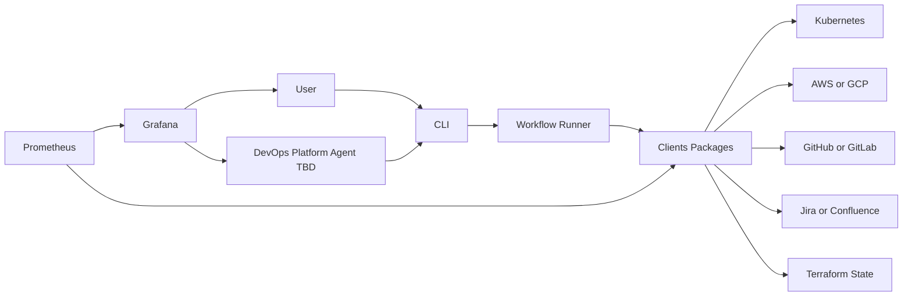

# Architecture

Date: 22.02.2026

## Scope

This document describes the high-level architecture for a self-healing DevOps platform with:
- **Automation** (actions/control)
- **Observation** (metrics/visibility)
- **DevOps Platform Agent** (optional orchestrator; TBD)

3rd-party integrations include (examples): Kubernetes, AWS/GCP, Jira/Confluence, GitHub/GitLab, Terraform state.

---

## Automation Platform

### Components
- **Python Clients Package**
  - Connectors that can **control** and **scrape** 3rd-party systems (actions + reads as needed).
- **CLI**
  - Primary interface for **human** and **AI** interaction.
  - Runs automation workflows and exposes a stable command surface.

### Responsibilities
- Execute operational actions (e.g., remediation, housekeeping, rollout steps).
- Provide a single, auditable execution path (CLI as the choke point).

---

## Observation Platform

### Components
- * Stateless Backend API (Metrics Exporter)**
  - Reads live data from 3rd-party APIs and exposes metrics for Prometheus.
  - No persistent database. Uses caching and rate limiting to make scraping stable.
- **Prometheus**
  - Scrapes the API (`/metrics`) on a schedule.
- **Grafana**
  - Visualizes metrics and drives alerts.

### Caching (in the API)
- **TTL cache per integration/endpoint** (configurable; seconds/minutes depending on source volatility).
- **Request coalescing** (deduplicate concurrent identical requests during a scrape window).
- **Timeouts** for all outbound calls; return partial metrics if some sources fail.
- Optional: **stale-while-revalidate** for expensive calls (serve slightly stale values while refreshing).

### Rate limiting (in the API)
- **Per-integration rate limits** (token bucket / leaky bucket style).
- **Concurrency caps** per integration to avoid burst fan-out on scrapes.
- **Backoff + jitter** on upstream throttling responses.
- Ensure the Prometheus scrape completes within its configured scrape timeout.

---

## DevOps Platform Agent (TBD)

- Orchestrator that decides *what to do* and *when to do it*.
- Executes actions only via the **CLI**.

---

## Main flows

1) **Observability**
- Metrics API reads 3rd-party systems (cached + rate-limited) → Prometheus scrapes → Grafana dashboards/alerts

2) **Automation**
- User/Agent → CLI → Python clients → 3rd-party systems (actions/control)

3) **Feedback loop**
- Grafana alerts/insights → User/Agent → CLI runs remediation workflows

---

## Flow chart

