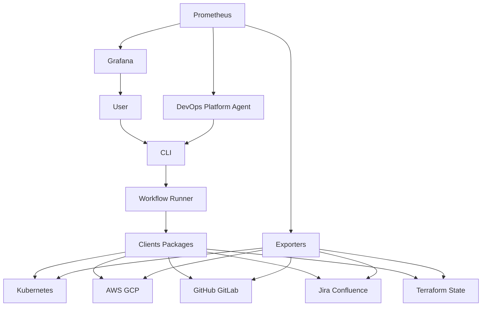

# Architecture

Date: 22.02.2026

## Scope

This document describes the high-level architecture for a self-healing DevOps platform with:
- **Automation** (actions/control)
- **Observation** (metrics/visibility)
- **DevOps Platform Agent** (optional orchestrator; TBD)

3rd-party integrations include (examples): Kubernetes, AWS/GCP, Jira/Confluence, GitHub/GitLab, Terraform state.

---

## Automation Platform

### Components
- **Python Clients Package**
  - Connectors that can **control** and **scrape** 3rd-party systems (actions + reads as needed).
- **CLI**
  - Primary interface for **human** and **AI** interaction.
  - Runs automation workflows and exposes a stable command surface.

### Responsibilities
- Execute operational actions (e.g., remediation, housekeeping, rollout steps).
- Provide a single, auditable execution path (CLI as the choke point).

---

## Observation Platform

### Components
- **Exporters**
  - Read data from 3rd-party APIs and expose metrics for Prometheus.
  - No persistent database. Use caching and rate limiting to keep scrapes stable.
- **Prometheus**
  - Scrapes exporters (`/metrics`) on a schedule.
- **Grafana**
  - Visualizes metrics and drives alerts.

---

## DevOps Platform Agent (TBD)

- Orchestrator that decides *what to do* and *when to do it*.
- Executes actions only via the **CLI**.

---

## Main flows

1) **Observability**
- Exporters read 3rd-party systems (cached + rate-limited) → Prometheus scrapes exporters → Grafana dashboards/alerts

2) **Automation**
- User/Agent → CLI → Python clients → 3rd-party systems (actions/control)

3) **Feedback loop**
- Grafana alerts/insights → User/Agent → CLI runs remediation workflows

---

## Flow chart

