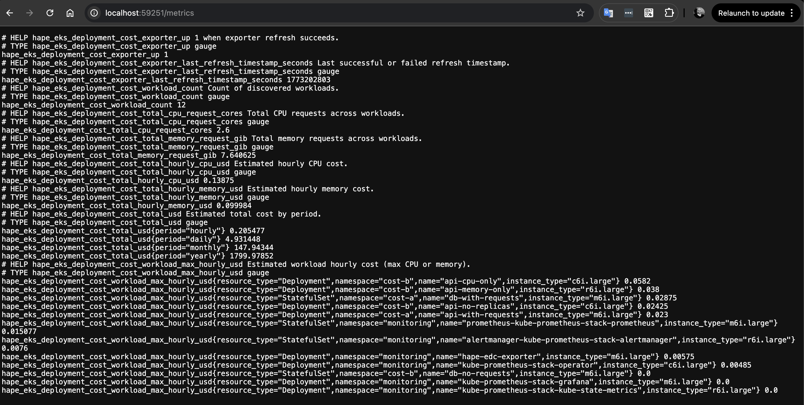
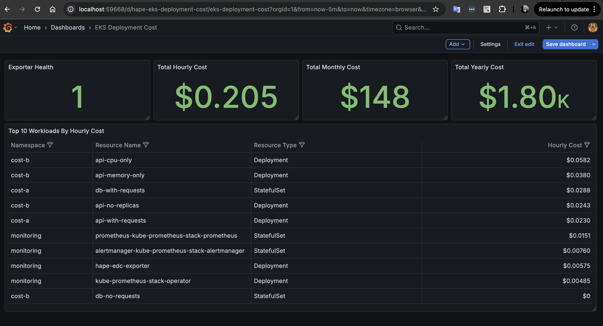

# EKS Deployment Cost Demo

## Files
- `eks-deployment-cost-summary.json`: metadata, totals, top costing workloads, and pricing context.
- `eks-deployment-cost-details.csv`: one row per workload with CPU and memory request based cost calculations.
- `prometheus-exporter-metrics.png`: Prometheus UI view of exporter metrics.
- `grafana-dashboard.png`: Grafana dashboard view for EKS deployment cost metrics.

## Screenshots
Prometheus exporter metrics view:



Grafana dashboard view:



## Prerequisites
- Python dependencies installed for this project.
- Functional test prerequisites from `tests/eks-deployment-cost/README.md` are met.

## Steps to reproduce this demo
1) Start local kind cluster:
```bash
make kind-up
```

2) Copy AWS credentials for local secret generation:
```bash
cp ~/.aws/credentials infrastructure/kubernetes/aws-credentials/.aws-credentials
```

3) Install monitoring stack (Prometheus and Grafana):
```bash
make helmfile-sync
```

4) Create AWS credentials secret:
```bash
make kustomize-apply infrastructure/kubernetes/aws-credentials
```

5) Apply demo workloads (namespaces, Deployments, StatefulSets):
```bash
make kustomize-apply infrastructure/kubernetes/eks-deployment-cost
```

6) Deploy exporter:
```bash
make kustomize-apply infrastructure/kubernetes/exporters/eks-deployment-cost
```

7) Open Grafana and import dashboard JSON:
```bash
kubectl -n monitoring port-forward svc/kube-prometheus-stack-grafana 3000:80
```
Then import `dashboards/eks-deployment-cost.json` in Grafana.

8) Optional: regenerate service output demo files:
```bash
HAPE_RUN_KIND_FUNCTIONAL_TESTS=1 python -m pytest tests/eks-deployment-cost -q -s
```
The output files in this directory were copied from the generated test outputs.

## Cleanup and Stop KIND Cluster
```bash
make kind-down
```

## Related documentation
- [Service logic and assumptions](../../docs/ops/eks-deployment-cost-service.md)
- [Local Kubernetes environment](../../infrastructure/kubernetes/README.md)
- [Functional tests](../../tests/eks-deployment-cost/README.md)
