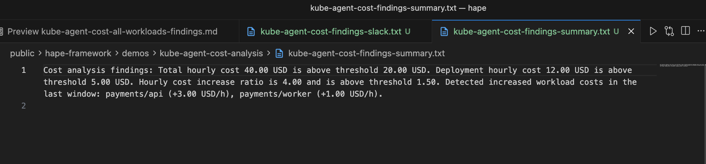
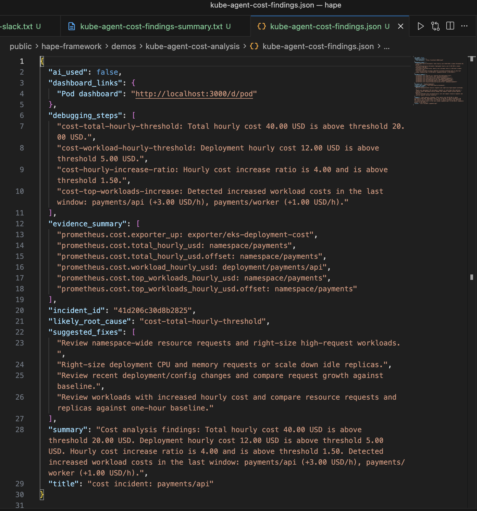
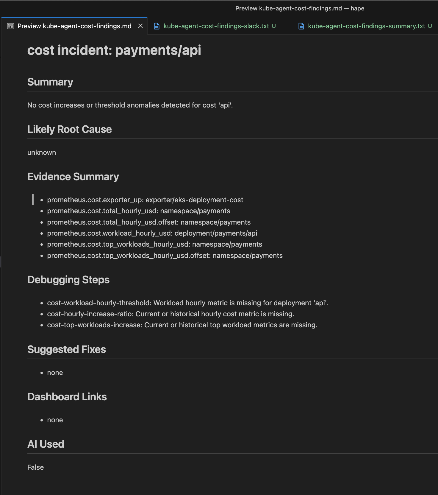
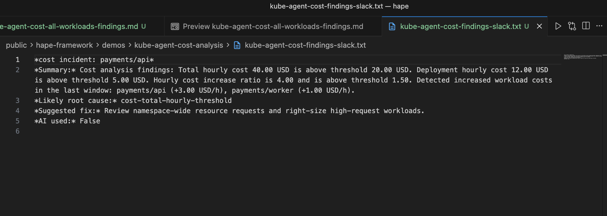
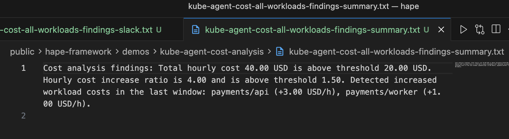
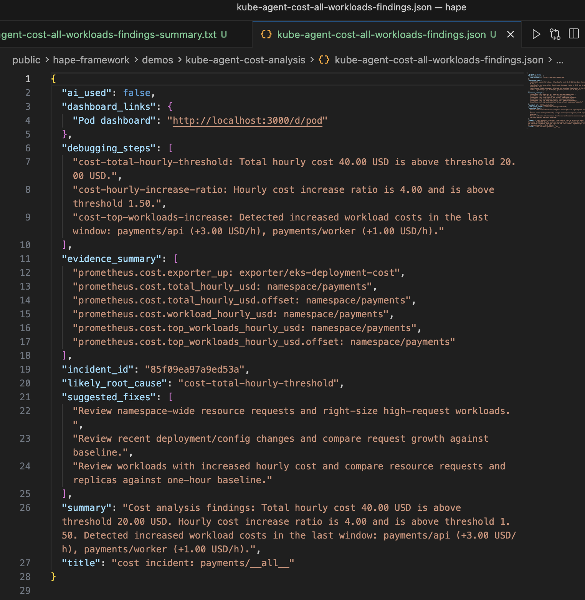
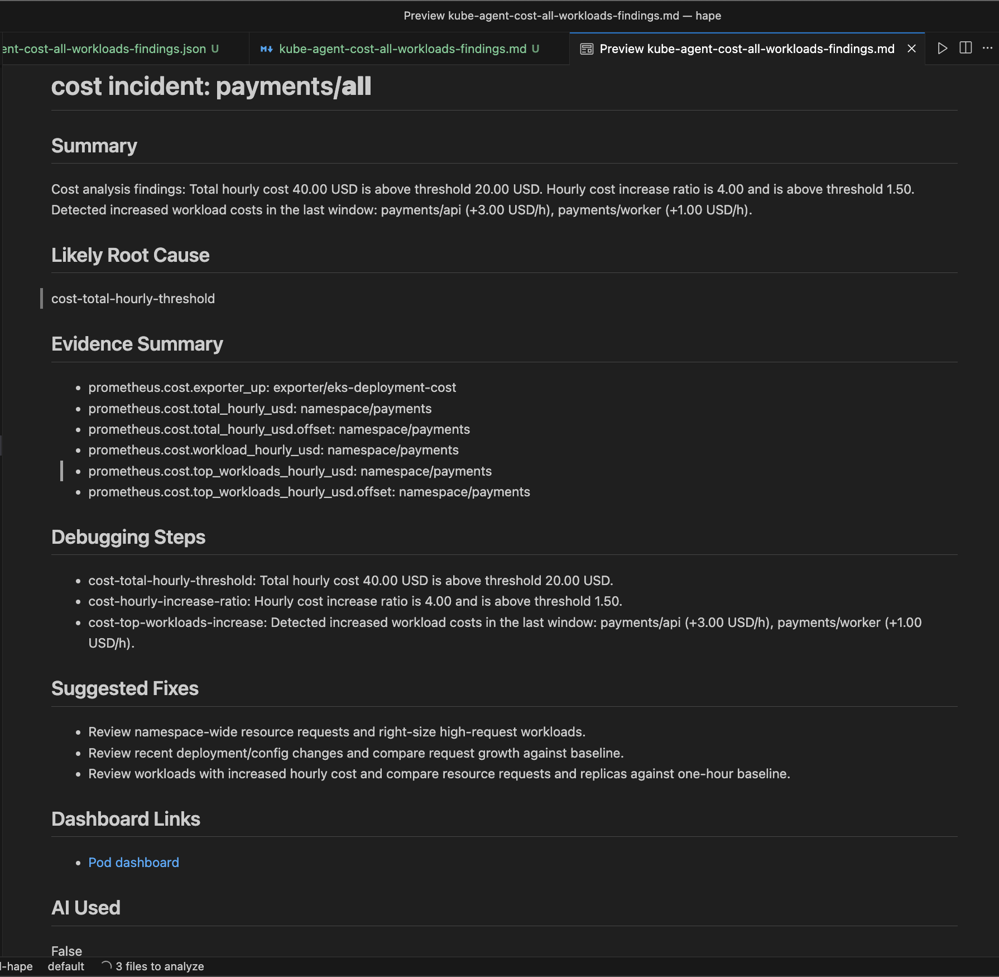
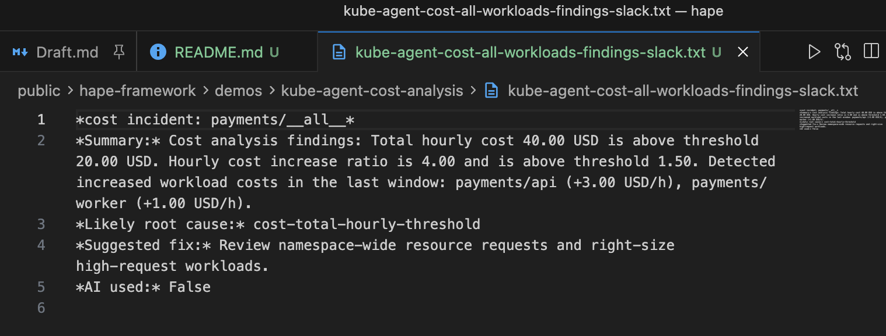

# Kube Agent Cost Analysis Demo

## Files
### Single deployment mode
- `kube-agent-cost-findings-summary.txt`: plain text summary output.
- `kube-agent-cost-findings.json`: machine-readable findings payload.
- `kube-agent-cost-findings.md`: markdown findings report.
- `kube-agent-cost-findings-slack.txt`: Slack-ready findings text.
- `kube-agent-cost-findings-summary.png`: summary output screenshot.
- `kube-agent-cost-findings-json.png`: JSON output screenshot.
- `kube-agent-cost-findings-markdown.png`: markdown output screenshot.
- `kube-agent-cost-findings-slack.png`: Slack output screenshot.

### All workloads mode
- `kube-agent-cost-all-workloads-findings-summary.txt`: plain text summary output with workload increases.
- `kube-agent-cost-all-workloads-findings.json`: machine-readable findings payload for all workloads mode.
- `kube-agent-cost-all-workloads-findings.md`: markdown findings report for all workloads mode.
- `kube-agent-cost-all-workloads-findings-slack.txt`: Slack-ready findings text for all workloads mode.
- `kube-agent-cost-all-workloads-findings-summary.png`: summary screenshot for all workloads mode.
- `kube-agent-cost-all-workloads-findings-json.png`: JSON screenshot for all workloads mode.
- `kube-agent-cost-all-workloads-findings-markdown.png`: markdown screenshot for all workloads mode.
- `kube-agent-cost-all-workloads-findings-slack.png`: Slack screenshot for all workloads mode.

## Prerequisites
- Python dependencies installed for this project.
- Functional test prerequisites from `tests/kube_agent/README.md` are met.
- `eks-deployment-cost` exporter is running and scraped by Prometheus.

## Screenshots
Summary output:



JSON output:



Markdown output:



Slack output:



All workloads summary output:



All workloads JSON output:



All workloads markdown output:



All workloads Slack output:



## Steps to reproduce this demo
1) Start local kind cluster:
```bash
make kind-up
```

2) Install monitoring stack:
```bash
make helmfile-sync
```

3) Create AWS credentials secret:
```bash
make kustomize-apply infrastructure/kubernetes/aws-credentials
```

4) Apply EKS deployment cost demo workloads and exporter:
```bash
make kustomize-apply infrastructure/kubernetes/eks-deployment-cost
make kustomize-apply infrastructure/kubernetes/exporters/eks-deployment-cost
```

5) Run cost analysis command (single deployment mode):
```bash
python main.py kube-agent cost-analyze --kube-context kind-hape --namespace payments --deployment api --historical-offset 1h --output markdown --use-ai false
```

6) Generate output artifacts (single deployment mode):
```bash
python main.py kube-agent cost-analyze --kube-context kind-hape --namespace payments --deployment api --output text --use-ai false > demos/kube-agent-cost-analysis/kube-agent-cost-findings-summary.txt
python main.py kube-agent cost-analyze --kube-context kind-hape --namespace payments --deployment api --output json --use-ai false > demos/kube-agent-cost-analysis/kube-agent-cost-findings.json
python main.py kube-agent cost-analyze --kube-context kind-hape --namespace payments --deployment api --output markdown --use-ai false > demos/kube-agent-cost-analysis/kube-agent-cost-findings.md
python main.py kube-agent cost-analyze --kube-context kind-hape --namespace payments --deployment api --output slack --use-ai false > demos/kube-agent-cost-analysis/kube-agent-cost-findings-slack.txt
```

7) Generate output artifacts (all workloads mode with 1h comparison):
```bash
python main.py kube-agent cost-analyze --kube-context kind-hape --namespace payments --all-workloads --historical-offset 1h --output text --use-ai false > demos/kube-agent-cost-analysis/kube-agent-cost-all-workloads-findings-summary.txt
python main.py kube-agent cost-analyze --kube-context kind-hape --namespace payments --all-workloads --historical-offset 1h --output json --use-ai false > demos/kube-agent-cost-analysis/kube-agent-cost-all-workloads-findings.json
python main.py kube-agent cost-analyze --kube-context kind-hape --namespace payments --all-workloads --historical-offset 1h --output markdown --use-ai false > demos/kube-agent-cost-analysis/kube-agent-cost-all-workloads-findings.md
python main.py kube-agent cost-analyze --kube-context kind-hape --namespace payments --all-workloads --historical-offset 1h --output slack --use-ai false > demos/kube-agent-cost-analysis/kube-agent-cost-all-workloads-findings-slack.txt
```

8) Verify artifacts:
- Confirm all four output files exist in `demos/kube-agent-cost-analysis/`.
- Confirm JSON output contains `incident_id`, `summary`, `evidence_summary`, and `suggested_fixes`.
- Confirm markdown and Slack outputs are non-empty and readable.
- Confirm all all-workloads output files exist in `demos/kube-agent-cost-analysis/`.
- Confirm all-workloads JSON output includes workload increase findings in `summary` or `debugging_steps`.

9) Capture screenshots for all workloads mode and place them in `demos/kube-agent-cost-analysis/`:
- `kube-agent-cost-all-workloads-findings-summary.png`
- `kube-agent-cost-all-workloads-findings-json.png`
- `kube-agent-cost-all-workloads-findings-markdown.png`
- `kube-agent-cost-all-workloads-findings-slack.png`

## Cleanup
```bash
make kind-down
```

## Related documentation
- [Kube agent user guide](../../docs/user/kube-agent.md)
- [Kube agent service logic](../../docs/ops/kube-agent-service.md)
- [EKS deployment cost exporter](../../docs/ops/exporters/eks-deployment-cost-exporter.md)
- [Kube agent architecture](../../docs/architectures/kube_agent_architecture.md)
