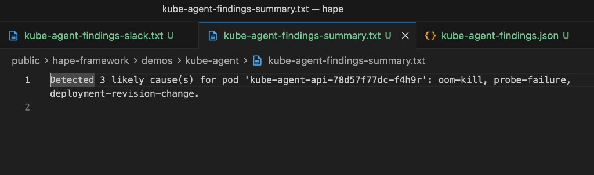
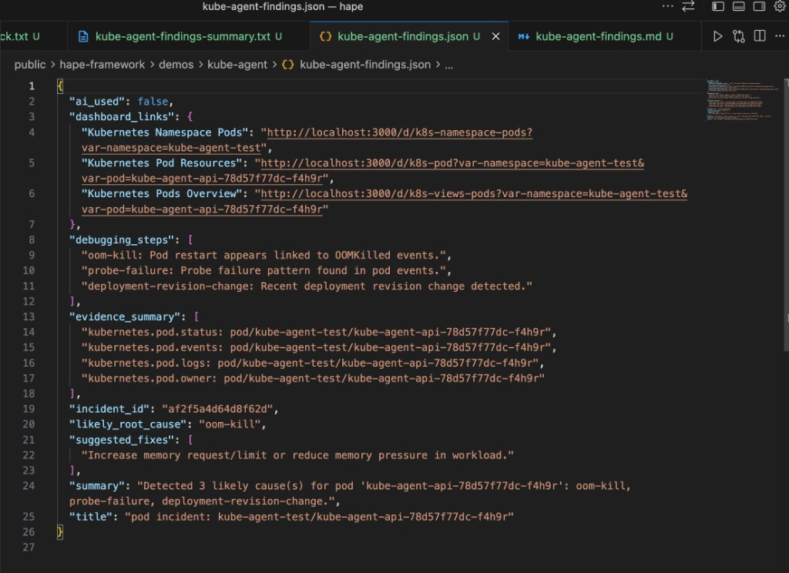
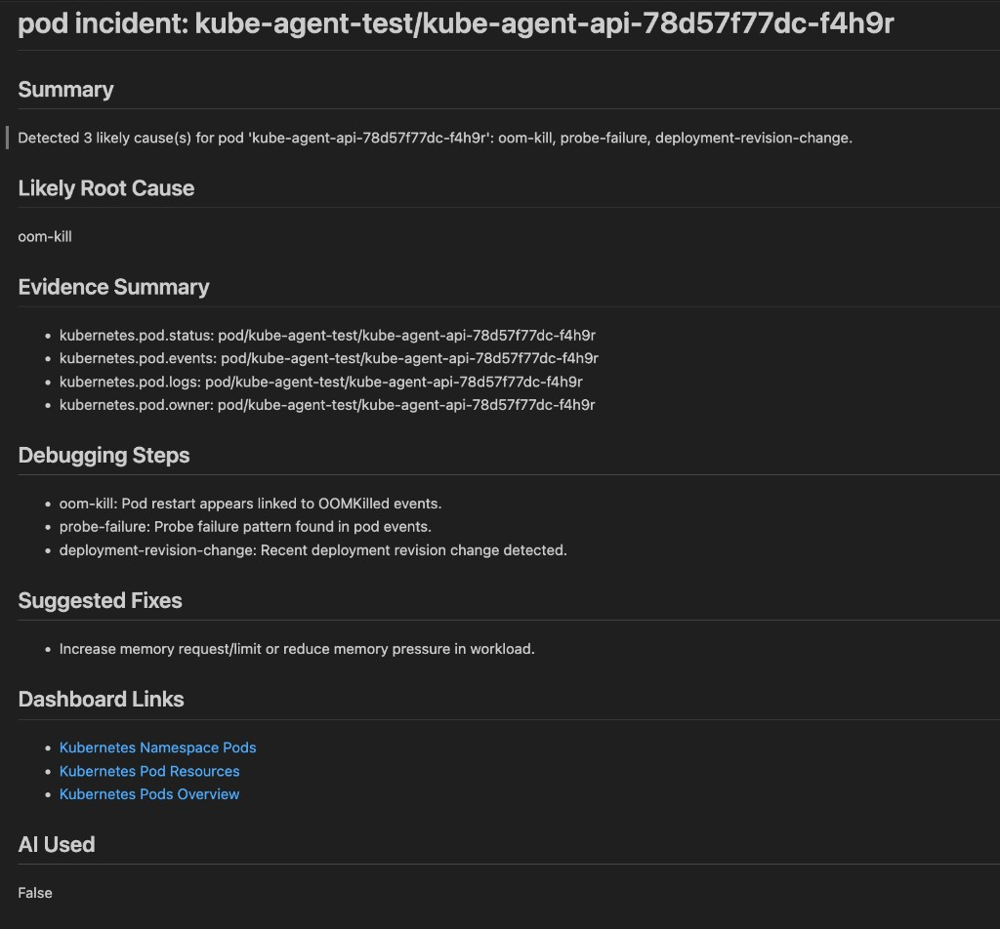
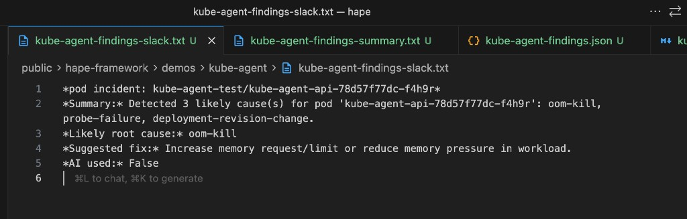

# Kube Agent Demo

## Files
- `kube-agent-findings-summary.txt`: plain text summary output.
- `kube-agent-findings.json`: machine-readable findings payload.
- `kube-agent-findings.md`: markdown findings report.
- `kube-agent-findings-slack.txt`: Slack-ready findings text.
- `kube-agent-findings-summary.png`: summary text output screenshot.
- `kube-agent-findings-json.png`: JSON findings output screenshot.
- `kube-agent-findings-markdown.png`: markdown findings output screenshot.
- `kube-agent-findings-slack.png`: Slack text output screenshot.

## Prerequisites
- Python dependencies installed for this project.
- Functional test prerequisites from `tests/kube_agent/README.md` are met.

## Screenshots
Summary output:



JSON output:



Markdown output:



Slack output:



## Steps to reproduce this demo
1) Start local kind cluster:
```bash
make kind-up
```

2) Run kube-agent functional test to generate artifacts:
```bash
HAPE_RUN_KUBE_AGENT_FUNCTIONAL_TESTS=1 python -m pytest tests/kube_agent/test_kube_agent_functional.py -s
```

3) Copy generated artifacts from the printed artifacts directory to this demo folder:
- `kube-agent-findings-summary.txt`
- `kube-agent-findings.json`
- `kube-agent-findings.md`
- `kube-agent-findings-slack.txt`

4) Verify artifacts:
- Confirm all four files exist in `demos/kube-agent/`.
- Confirm `kube-agent-findings.json` contains `incident_id`, `summary`, `dashboard_links`, and `ai_used`.
- Confirm markdown and Slack files are non-empty and human-readable.

5) Capture screenshots and place them in `demos/kube-agent/`:
- `kube-agent-findings-summary.png`
- `kube-agent-findings-json.png`
- `kube-agent-findings-markdown.png`
- `kube-agent-findings-slack.png`

## Cleanup
```bash
make kind-down
```

## Related documentation
- [Kube agent user guide](../../docs/user/kube-agent.md)
- [Kube agent service logic](../../docs/ops/kube-agent-service.md)
- [Kube agent functional tests](../../tests/kube_agent/README.md)
