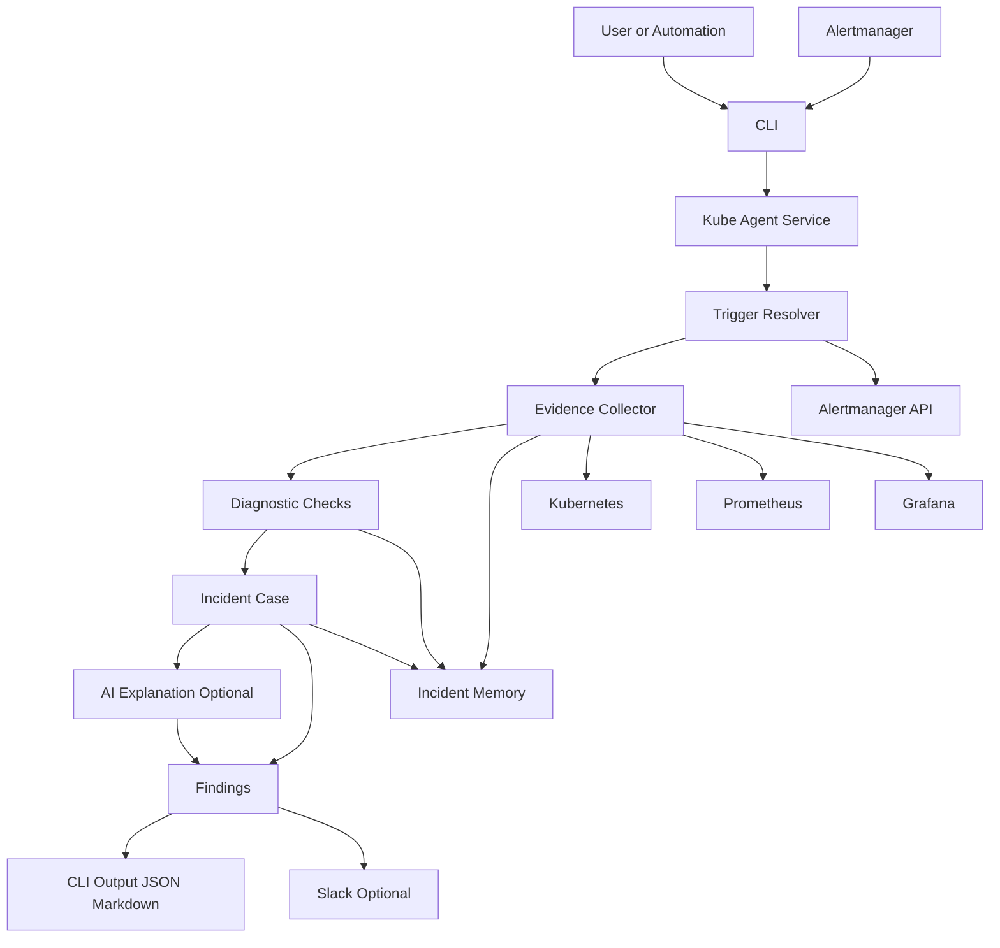
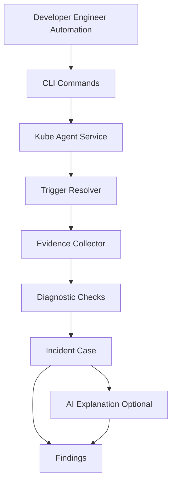
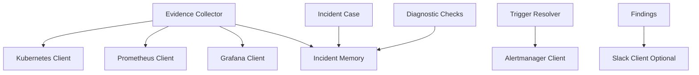
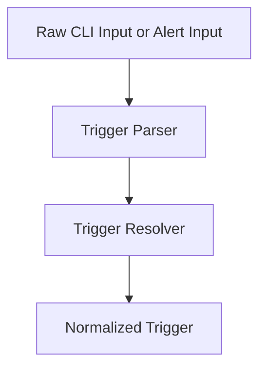
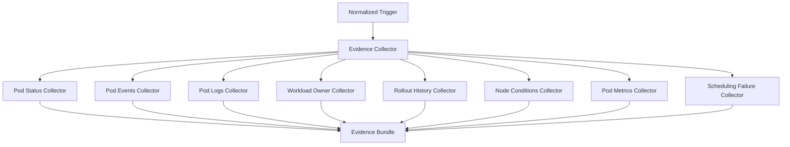
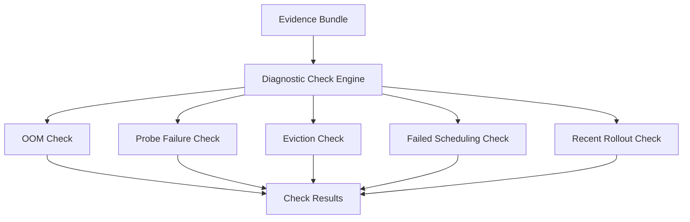
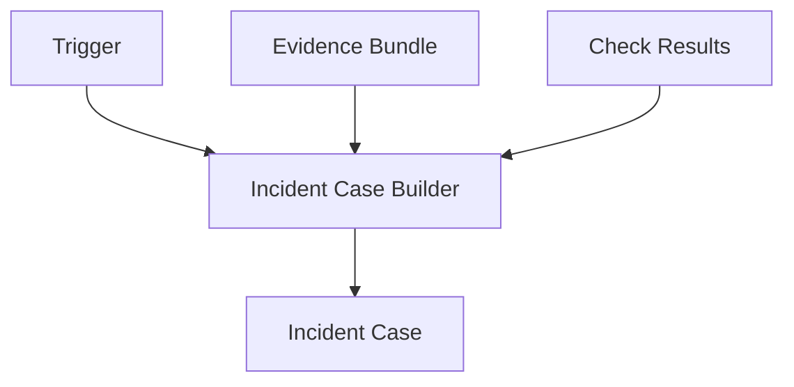
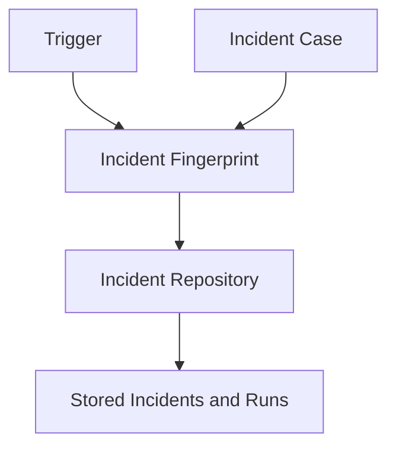

# Kube Agent Architecture

Date: 12.03.2026

## Scope
This document describes the high-level architecture for `hape-kube-agent`.
`hape-kube-agent` investigates Kubernetes incidents with a CLI-first workflow.
The first version is focused on:
- **Kubernetes incidents** only
- **Read-only investigation** only
- **Deterministic checks first**
- **AI explanation as an optional final step**

Supported integrations in the first version:
- Kubernetes
- Prometheus
- Alertmanager
- Grafana
- Slack

Out of scope for the first version:
- Operators
- Automatic remediation
- Write actions against the cluster
- Generic agent tool-calling loops
- Cost analysis

---

## Flow chart

---

## Main flows
1) **Manual investigation**
- User → CLI → Trigger Resolver → Evidence Collector → Diagnostic Checks → Incident Case → optional AI Explanation → Findings

2) **Alert-driven investigation**
- Alertmanager alert → CLI input or scheduled CLI run → Trigger Resolver → same investigation pipeline

3) **Incident memory**
- Evidence, check results, and incident case metadata are stored → repeated incidents can be matched and handled without repeating the same full review each time

---

## Kube Agent Platform

### Components
- **CLI**
  - Primary entrypoint for users and future automation.
  - Starts investigations and reads saved incidents.
- **Trigger Resolver**
  - Normalizes the raw investigation input.
- **Evidence Collector**
  - Collects Kubernetes and Prometheus facts.
  - Resolves Grafana links for the final result.
- **Diagnostic Checks**
  - Runs deterministic checks on the collected evidence.
- **Incident Case**
  - Builds a structured case from trigger, evidence, and check results.
- **AI Explanation**
  - Optional final step.
  - Uses the incident case only.
- **Findings**
  - Formats the final result for CLI, JSON, Markdown, and Slack.
- **Incident Memory**
  - Stores incidents, runs, fingerprints, and occurrence history.

### Responsibilities
- Investigate Kubernetes incidents using a read-only pipeline.
- Keep data collection separate from AI explanation.
- Prefer deterministic checks over free-form AI reasoning.
- Build a repeatable and testable incident review flow.
- Store repeated incidents so the same incident is not reviewed from scratch every time.

### Architecture

#### Layers
- **CLI**: Argument parsing and user input handling. Commands call services only.
- **Services**: Domain logic for the full kube-agent pipeline.
- **Clients**: Low-level adapters for Kubernetes, Prometheus, Alertmanager, Grafana, and Slack.
- **Stores**: Persistence for incident memory.
- **Core**: Shared configuration, logging, and error handling.
- **Utils**: Shared helpers and formatters.

#### Layer Restrictions
- CLI must not call clients directly. All external access goes through services.
- Kube-agent services may call multiple clients, but clients must not call services.
- Clients must not call other clients.
- AI Explanation must not call Kubernetes, Prometheus, Alertmanager, Grafana, or Slack clients directly.
- Evidence Collector is responsible for external evidence collection.
- Diagnostic Checks must work on normalized evidence, not on raw API responses.
- Incident Memory must store investigation results, but must not contain evidence collection logic.
- Core and utils are reusable by any layer, but should not depend on services or CLI.

#### General Flow

Core and utils are shared across all layers.

#### Directory Layout
- `cli/commands/` → CLI entry for kube-agent commands
- `services/kube_agent/triggers/` → Trigger parsing and normalization
- `services/kube_agent/evidence/` → Evidence collection and normalization
- `services/kube_agent/checks/` → Diagnostic checks and check registry
- `services/kube_agent/case/` → Incident case models and builders
- `services/kube_agent/ai/` → AI explanation only
- `services/kube_agent/findings/` → User-facing result builders and formatters
- `services/kube_agent/memory/` → Incident fingerprinting and persistence logic
- `clients/` → External system clients
- `stores/` → SQLite-backed incident storage
- `docs/` → Architecture, user, and operations documentation

#### Naming Conventions
- Clients: `*_client.py`
- Services: `*_service.py`
- CLI commands: `*_commands.py`
- Collectors: `*_collector.py`
- Checks: `*_check.py` or grouped in `*_checks.py`
- Repositories: `*_repository.py`

#### Example Responsibility Split
- CLI: `kube_agent_commands.py` parses `--namespace`, `--pod`, `--alertname`, and output flags
- Service: `kube_agent_service.py` runs the investigation workflow
- Trigger: `trigger_resolver.py` converts raw input into a normalized trigger
- Evidence: `evidence_collector.py` gathers pod status, events, logs, rollout context, node conditions, and metrics
- Checks: `diagnostic_check_engine.py` runs deterministic diagnosis checks
- Case: `incident_case_builder.py` builds the structured incident case
- AI: `ai_explainer.py` explains the incident case only
- Findings: `findings_builder.py` prepares the final output
- Store: `incident_repository.py` saves incident history

#### Configuration
- Kube-agent configuration should live under the existing HAPE config model.
- Thresholds, time windows, and PromQL templates should be kept separate from command logic.
- AI should be configurable and disabled by default if no provider is configured.

---

## Trigger Resolver

### Purpose
Normalize the raw input that starts an investigation.

### Supported trigger types
- Pod trigger
- Deployment trigger
- Node trigger
- Alert trigger

### Trigger workflow

### Responsibilities
- Accept raw input from CLI or Alertmanager.
- Validate required identifiers.
- Resolve a consistent internal trigger model.
- Attach labels and annotations if available.

---

## Evidence Collector

### Purpose
Collect facts from external systems and normalize them into a single evidence bundle.

### Evidence sources
- Kubernetes API
- Prometheus API
- Grafana dashboard link resolution

### Evidence workflow

### Responsibilities
- Collect facts only.
- Do not make conclusions.
- Normalize raw responses into evidence items.
- Collect only the evidence needed for the active trigger.
- Attach Grafana links to the evidence bundle when available.

---

## Diagnostic Checks

### Purpose
Run deterministic checks against the normalized evidence bundle.

### Initial check packs
- Pod restart checks
- Pod pending checks
- Node condition checks
- Rollout regression checks
- Probe failure checks
- Image pull checks

### Check workflow

### Responsibilities
- Work on normalized evidence only.
- Return deterministic check results.
- Mark checks as matched, not matched, or inconclusive.
- Keep check logic independent from AI explanation.

---

## Incident Case

### Purpose
Create a structured investigation result from trigger, evidence, and check results.

### Responsibilities
- Build a single incident case object.
- Group related evidence.
- Build likely causes and hypotheses from check results.
- Prepare recommendations and debugging steps.
- Produce a stable structure for AI explanation and findings formatting.

### Case workflow

---

## AI Explanation

### Purpose
Explain the incident case in human-readable form.

### Rules
- Optional only
- Read-only only
- Uses the incident case only
- No direct calls to Kubernetes, Prometheus, Alertmanager, Grafana, or Slack

### Responsibilities
- Summarize the incident case.
- Explain possible root causes.
- Suggest debugging steps.
- Suggest possible fixes.
- Reduce free-form reasoning by using the bounded incident case as input.

---

## Findings

### Purpose
Build the final user-facing output.

### Output formats
- CLI text
- JSON
- Markdown
- Slack message

### Responsibilities
- Present the likely root cause.
- Present the supporting evidence summary.
- Present debugging steps and suggested fixes.
- Include dashboard links when available.
- Mark whether AI was used.

---

## Incident Memory

### Purpose
Store repeated incidents and investigation history.

### Responsibilities
- Save incident fingerprints.
- Save investigation runs.
- Store occurrence history.
- Detect repeated incidents.
- Help skip repeated full review when the incident is materially the same.

### Memory workflow

### Storage
- First version should use SQLite.
- Storage should remain simple and local.
- The schema should be optimized for incident lookup and repeated occurrence tracking.

---

## First version scope
- CLI-first execution only
- Read-only Kubernetes incident investigation
- Kubernetes, Prometheus, Alertmanager, Grafana, and Slack integrations only
- Deterministic checks before AI explanation
- SQLite-backed incident memory
- No operator
- No automatic remediation
