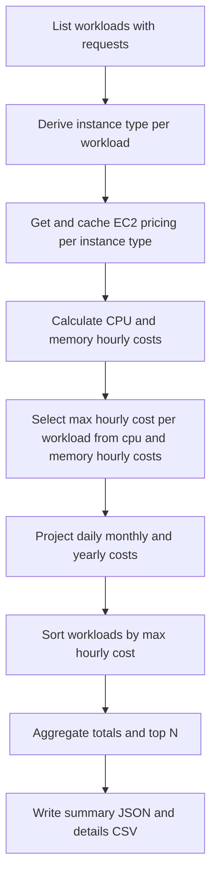
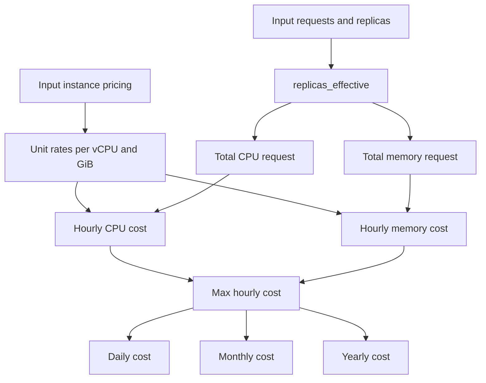

# EKS Deployment Cost Service Logic

## Purpose
Document how `EksDeploymentCostService` builds cost reports, what assumptions it makes, and how to validate outcomes during operations.

## Service location
- `services/eks_deployment_cost_service.py`

## What the service produces
- `eks-deployment-cost-summary.json` with metadata, totals, top costing workloads, and instance pricing context.
- `eks-deployment-cost-details.csv` with one row per workload and calculated cost fields.

## Inputs and defaults
- Required: `kube_context`, `aws_profile`, `output_dir`.
- Optional: `aws_region`, `kube_config_file`, `namespaces_csv`, `resource_types_csv`, `top_n`.
- Supported resource types are only `Deployment` and `StatefulSet`.
- If `resource_types_csv` is omitted, both supported resource types are used.
- If `namespaces_csv` is omitted, all namespaces are included.
- `top_n` must be greater than zero.

## Processing flow


1. List workloads with CPU and memory requests from Kubernetes.
2. Derive instance type for each workload from matching pods.
3. Fetch and cache EC2 pricing details per unique instance type.
4. Compute hourly CPU and memory costs from requests and unit rates.
5. Use `max(hourly_cpu_cost_usd, hourly_memory_cost_usd)` as the workload hourly estimate.
6. Project daily, monthly, and yearly costs from hourly values.
7. Sort workloads by `max_hourly_cost_usd`, aggregate totals, and produce top N.
8. Write `eks-deployment-cost-summary.json` and `eks-deployment-cost-details.csv`.

## Cost calculation logic


- Price inputs come from EC2 instance pricing details: `hourly_instance_price_usd`, `vcpu`, `memory_gib`.
- Unit rates are derived as:
  - `usd_per_vcpu_hour = hourly_instance_price_usd / vcpu`
  - `usd_per_gib_hour = hourly_instance_price_usd / memory_gib`
- Workload resource totals are derived as:
  - `replicas_effective = replicas or 1`
  - `total_cpu_request_cores = cpu_request_cores_per_pod * replicas_effective`
  - `total_memory_request_gib = memory_request_gib_per_pod * replicas_effective`
- Component costs are:
  - `hourly_cpu_cost_usd = total_cpu_request_cores * usd_per_vcpu_hour`
  - `hourly_memory_cost_usd = total_memory_request_gib * usd_per_gib_hour`
- Final hourly estimate per workload is a conservative maximum:
  - `max_hourly_cost_usd = max(hourly_cpu_cost_usd, hourly_memory_cost_usd)`
- Projections are:
  - `daily = hourly * 24`
  - `monthly = hourly * 24 * 30`
  - `yearly = hourly * 24 * 365`
- Currency and aggregate outputs are rounded to 6 decimal places.

## Operational assumptions
- The model uses Kubernetes pods `requests` values, not actual runtime usage.
- Missing CPU or memory requests are treated as zero.
- If a workload does not expose replicas, the service treats it as one replica for calculations.
- Instance type derivation depends on pods being scheduled and discoverable from workload selector labels.

## Error handling paths
- Validation failures raise `HapeValidationError`.
- Kubernetes read failures are wrapped as `HapeExternalError` with `EDC_KUBERNETES_READ_FAILED`.
- Missing instance type derivation raises `HapeExternalError` with `EDC_INSTANCE_TYPE_DERIVE_FAILED`.
- AWS pricing lookup failures raise `HapeExternalError` with `EDC_AWS_PRICING_LOOKUP_FAILED`.
- Report write failures raise `HapeOperationError` with `EDC_REPORT_WRITE_FAILED`.

## Verification steps
1. Run:
```bash
hape eks-deployment-cost report \
  --kube-context <kube-context> \
  --aws-profile <aws-profile> \
  --output-dir <output-dir>
```
2. Confirm both output files exist in `<output-dir>`.
3. Confirm summary totals match the sum of CSV rows for key cost columns.
4. Confirm `top_costing_workloads` is sorted descending by `max_hourly_cost_usd`.
5. Confirm metadata fields reflect requested namespace, resource type, region, and `top_n`.

## Test coverage reference
- Functional scenario and expected behavior are covered by `tests/eks-deployment-cost/test_eks_deployment_cost_functional.py`.
- Local cluster setup and manifests are under `tests/eks-deployment-cost/`.
