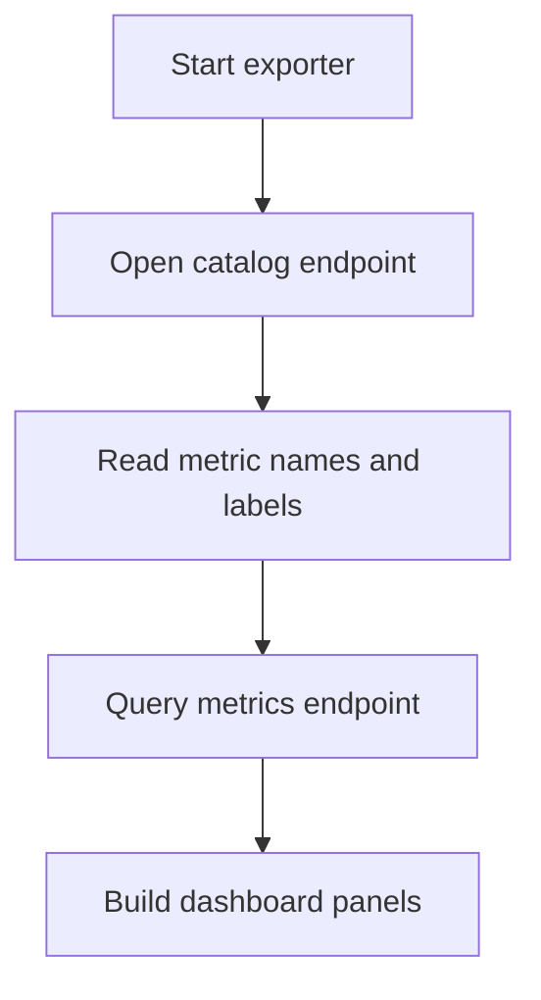

# EKS Deployment Cost Exporter

## Purpose
This runbook explains how to view exporter metrics quickly and how to inspect the metric catalog.

## Service location
- `exporters/eks_deployment_cost_exporter.py`

## Endpoints
- `GET /metrics` returns Prometheus exposition format.
- `GET /metrics-catalog` returns JSON with metric names, descriptions, and labels.
- `GET /catalog` returns the same JSON as `GET /metrics-catalog`.
- `GET /` returns the same JSON as `GET /metrics-catalog`.
- `GET /healthz` returns `ok` or `degraded`.

## Workflow


## Start exporter
1. Optional: set kube context and AWS profile only if you want to override local defaults:
```bash
export HAPE_EDC_KUBE_CONTEXT=<kube-context>
export HAPE_EDC_AWS_PROFILE=<aws-profile>
export HAPE_EDC_IGNORED_NAMESPACES=kube-system,kube-node-lease,kube-public,local-path-storage
```
If `HAPE_EDC_KUBE_CONTEXT` or `HAPE_EDC_AWS_PROFILE` are not set, the service tries the current kube context and AWS default profile automatically.
`HAPE_EDC_IGNORED_NAMESPACES` is comma-separated and defaults to `kube-system,kube-node-lease,kube-public,local-path-storage`.
2. Start exporter from repository root:
```bash
python exporters/eks_deployment_cost_exporter.py
```

## Supported config keys
- `HAPE_EXPORTER_HOST`
- `HAPE_EXPORTER_PORT`
- `HAPE_EXPORTER_REFRESH_SECONDS`
- `HAPE_EDC_KUBE_CONTEXT`
- `HAPE_EDC_AWS_PROFILE`
- `HAPE_EDC_IGNORED_NAMESPACES`

## Quick metric discovery
Use this command to list all metric definitions in readable JSON:
```bash
curl -s http://localhost:9117/metrics-catalog
```

Example output shape:
```json
{
  "metrics": [
    {
      "name": "hape_eks_deployment_cost_total_usd",
      "type": "gauge",
      "description": "Estimated total cost by period.",
      "labels": ["period=hourly|daily|monthly|yearly"]
    }
  ]
}
```

## Verify Prometheus payload
Use this command to inspect the first metric lines:
```bash
curl -s http://localhost:9117/metrics
```

## Kube-agent integration
`kube-agent` cost analysis consumes exporter metrics through Prometheus queries.
Run from repository root:
```bash
hape kube-agent cost-analyze --kube-context demo --namespace payments --deployment api --historical-offset 1h --output markdown --use-ai false
```
