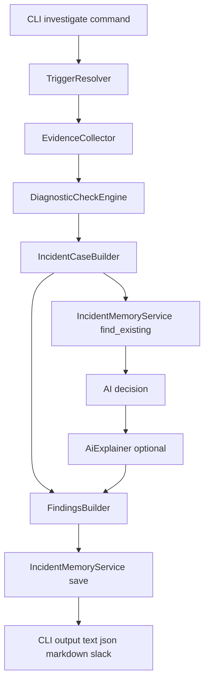

# Kube Agent Service Logic

## Purpose
Document how `KubeAgentService` executes investigations and how operators validate behavior.

## Service and module locations
- Service entrypoint: `services/kube_agent/kube_agent_service.py`.
- Trigger layer: `services/kube_agent/triggers/`.
- Evidence layer: `services/kube_agent/evidence/`.
- Check layer: `services/kube_agent/checks/`.
- Incident case layer: `services/kube_agent/case/`.
- AI layer: `services/kube_agent/ai/`.
- Findings layer: `services/kube_agent/findings/`.
- Incident memory layer: `services/kube_agent/memory/`.
- CLI commands: `cli/commands/kube_agent_commands.py`.

## Runtime flow


## Layer boundaries
- CLI parses arguments and calls `KubeAgentService` only.
- `KubeAgentService` orchestrates trigger, evidence, checks, case, AI, findings, and memory.
- Clients perform transport operations only.
- Deterministic checks consume normalized evidence only.
- AI explanation consumes `IncidentCase` only.
- Memory service stores fingerprints and runs and does not collect evidence.

## Trigger handling
- Supported kinds are `pod`, `deployment`, `node`, `alert`, and `cost`.
- Trigger parsing normalizes names and maps kind-specific fields.
- Trigger resolver enforces required fields by kind.

## Evidence collection behavior
- Kubernetes evidence includes pod status, events, logs, owner, rollout context, node conditions, and scheduling failures.
- Prometheus evidence includes pod, node, alert, and cost-focused query outputs.
- Alertmanager evidence adds matched alerts for alert triggers.
- Grafana default dashboard collector selects high-value kube-prometheus-stack dashboards with resource query variables.
- Grafana link resolver adds additional dashboard links into the evidence bundle.

## Deterministic checks behavior
- Check engine runs registry checks and returns `matched`, `not_matched`, or `inconclusive`.
- Check packs include restart, pending, node conditions, rollout regression, probe failures, image pull checks, and cost anomaly checks.
- Incident case builder derives likely causes, hypotheses, recommendations, and related resources from check results.

## AI explanation behavior
- AI is optional and runs after deterministic checks.
- AI input is the bounded incident case.
- AI rerun logic uses incident fingerprint and staleness window.

## Incident memory behavior
- SQLite schema stores incidents and investigation runs.
- Fingerprint includes cluster, namespace, kind, resource name, and normalized cause signature.
- Repeated incidents increment `occurrence_count`.
- `incidents list` and `incidents show` read from SQLite memory.

## Operational validation
1. Run a pod investigation:
```bash
hape kube-agent investigate pod --kube-context demo --namespace payments --pod api --output markdown --use-ai false
```
2. Confirm output includes summary, likely root cause, and debugging steps.
3. Run incident list:
```bash
hape kube-agent incidents list --output text
```
4. Confirm latest incident appears.
5. Repeat the same investigate command.
6. Confirm occurrence count increases in `incidents show`.
7. Run cost analysis:
```bash
hape kube-agent cost-analyze --kube-context demo --namespace payments --deployment api --historical-offset 1h --output markdown --use-ai false
```
8. Confirm output includes exporter health, hourly cost context, and threshold-based anomaly statuses.
9. Run namespace-wide cost increase analysis:
```bash
hape kube-agent cost-analyze --kube-context demo --namespace payments --all-workloads --historical-offset 1h --output markdown --use-ai false
```
10. Confirm findings include workloads that increased compared to one hour ago.

## Test references
- Kube-agent unit and integration tests: `tests/kube_agent/`.
- Run all kube-agent tests:
```bash
python -m pytest -q tests/kube_agent
```
